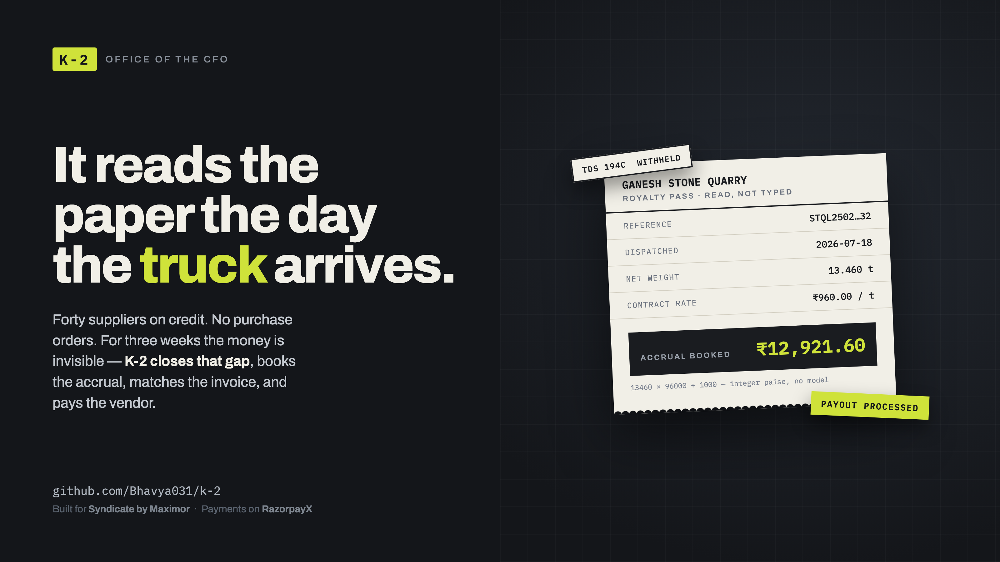
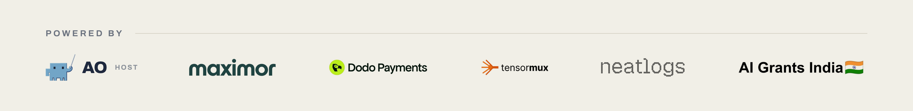

# K-2



***K-2 keeps the books while the trucks keep coming.***

An autonomous office of the CFO for a civil contractor who has never had one. It
reads the paper a truck driver carries, books the liability the same day, matches
the supplier's invoice against it three weeks later, withholds tax and retention,
and pays the vendor — once a human has pressed approve.

Royalty pass → accrual booked → invoice matched → TDS withheld → **a human's
thumb** → money leaves the bank.

Built for [Syndicate by Maximor](https://maximor.com) — Track 2, Autonomous
Office of the CFO, September 2026.

**Stack:** Bun, TypeScript, STRICT SQLite, Claude vision, RazorpayX Payouts,
Telegram Bot API, Gmail API. No runtime dependencies.

## Powered by



K-2 was built on **[AO — Agent Orchestrator](https://aoagents.dev)**, the
hackathon's host and the reason this repository exists: every line of product
code in `src/` was written by autonomous coding agents dispatched through it,
across thirty-four merged pull requests. **Maximor** set the brief — an office
of the CFO that runs itself — and **Dodo Payments**, **TensorMux**,
**Neatlogs** and **AI Grants India** backed the build.

## How it works

Local-first. The company's machine, the company's paper, the company's SQLite
file — nothing is uploaded except the payout instruction a person approved.

1. **Paper arrives.** A driver's royalty pass or delivery challan lands as a
   scan, a Gmail attachment (`bun run gmail-intake`), a Telegram photo, or a
   file dropped in `./intake`. Every page is stored and hashed; nothing is
   silently dropped.
2. **The model reads it.** Pages are classified, multi-document scans are cut
   into real documents, and a vision model extracts *printed fields only* —
   vendor, reference, date, net weight.
3. **Arithmetic books the accrual.** `13460 kg × ₹960/t = ₹12,921.60`, in
   integer paise, at the vendor's contracted rate. No model touches a number.
   The three-week hole closes the day the truck arrives.
4. **The invoice shows up weeks later** and is matched against the accrual —
   exact, within tolerance, or disagreeing. A disagreement is named and routed
   to a human. It never auto-clears.
5. **A payment run is prepared.** 194C TDS at 200 bps, retention at 500 bps, per
   line. A vendor with no human-verified bank details is **held**, not paid.
6. **A human approves from their phone.** The Telegram bot shows gross, TDS,
   retention, net payable and held lines in Hindi and English. Press approve and
   RazorpayX executes the payout.

Ask the ledger anything at `bun run ask-ledger` — every displayed figure is
computed from stored rows and cites them, next to the actual scanned page.

---

## The payment rail, proven end to end

The full loop runs in **RazorpayX test mode**: all seven vendors exist as
contacts with fund accounts, a prepared payout is approved from a phone, and the
money moves.

A real approval, taken from the Telegram bot, reaching `processed`:

```
pout_TYtDmp2s6oWEM0   processed   7700000 paise   IMPS   vendor bill
                                  ₹77,000.00 — GANESH STONE QUARRY
```

The message the approver actually sees, in the language they speak:

```
भुगतान रन / Payment run: …
सकल / Gross: ₹…      टीडीएस / TDS: ₹…
रिटेंशन / Retention: ₹…    शुद्ध देय / Net payable: ₹…
होल्ड लाइनें / Held lines: 1

[ मंज़ूर / Approve ]   [ अस्वीकार / Reject ]
```

Press approve and the payout appears in RazorpayX moving
`queued → processing → processed`. Press it twice and nothing happens the second
time — the idempotency key is the same.

---

## The safety boundary

K-2 pays only what a human has approved, to a payee a human has verified.

The pipeline prepares a payout request. It cannot invent a payee, cannot release
a held line, and cannot approve its own work. Every safeguard below is enforced
by the schema, a TTY check and the filesystem — not by a policy document:

- **Payee creation is human-only.** `vendor_payment_methods` is written by one
  script that refuses to run unless stdin is an interactive terminal and makes
  the operator retype the full account number. No pipeline, batch command, model
  or agent can add a payee.
- **A payout is built only on an exact match.** The instruction's account number
  *and* IFSC must equal a human-verified row. Anything else is refused with a
  named reason.
- **A line with no verified beneficiary is held**, and approving the run does
  not release it.
- **Approving twice cannot pay twice.** The idempotency key is derived from the
  request content, so a one-paise change is a different key and an identical
  request is the same one.

Autonomous clearing of variances is deliberately not shipped: a disagreement
between two pieces of paper is named and held for a human.

No credentials, account numbers, private source documents or prompt logs belong
in this repository. The only non-synthetic PDFs committed here are public tender
notices. Any generated invoice used in a demonstration is explicitly marked
**SYNTHETIC / SIMULATED** and is not a real supplier invoice.

---

## The problem, precisely

A civil contracting company in Gujarat, India. Forty to fifty suppliers, almost
all on credit. There is no purchase order system and there never has been.

A cost begins its life as paper a truck driver carries: a royalty pass proving
the material was legally mined, or a delivery challan from the quarry. The
supplier's invoice arrives about three weeks later. Payment goes out about
three weeks after that.

For those three weeks, that money is invisible. Material is on site, the
liability is real, and nothing in the company knows about it. At month end the
owner is guessing what he owes.

---

## Proven on real paper

A live end-to-end run against a genuine scanned royalty pass and delivery
challan from the company's own files (not committed to this repository):

| | |
|---|---|
| Vendor | matched to a human-verified quarry supplier |
| Reference | read from the printed pass |
| Quantity | 13.460 t, from a printed "13460 kg" |
| Date | 2026-07-18, from a printed "18/07/2026" |
| **Accrual** | **₹12,921.60** — computed, not read |

The amount is arithmetic the model never saw: `13460 × 96000 ÷ 1000 = 1292160`
paise, at the vendor's contracted rate. Two genuine disagreements between the
pass and the challan were caught and routed to the review queue rather than
guessed at.

---

## Rules the code is built on

These are business rules, not style preferences. A stage that breaks one is
wrong even if its tests pass.

- **Money is an integer count of paise.** No float touches money anywhere. We
  deduct tax at source and retention per line, sum lines into a vendor total,
  and sum vendors into a run total that leaves the bank. One float and the total
  stops reconciling to the lines, and a real accountant rejects the batch.
- **Quantity is an integer count of thousandths.** A weighbridge prints
  kilograms; 13460 kg is 13.460 tonnes, stored as 13460, converted once, where
  the paper is read.
- **Rates are basis points.** 200 is two percent.
- **The model reads paper. Arithmetic is deterministic.** No figure in the
  ledger is ever produced by a model call.
- **Nothing is silently dropped.** Every input is stored, sent to a human, or
  recorded as already handled.

---

## What is shipped

| # | Stage | What it gives you |
|---|---|---|
| 1 | Foundation | Typed money/quantity/provenance, STRICT SQLite, config-once-at-startup |
| 2 | Model boundary | One retry, only on schema-validation failure, only here |
| 3 | Ingest and classify | Page render, hashing, duplicate guard, per-page document type |
| 4 | Segment and extract | Multi-document scans cut into real documents; printed fields read |
| 5 | Review queue and intake | Every uncertainty becomes a human decision, never a silent default |
| 6 | Ledger and accruals | The three-week hole, closed |
| 7 | Match and payment run | Invoice-to-accrual matching, TDS and retention, prepared payout |
| 8 | Report page | Offline month-end position, no server, no network |
| 9 | Asking the ledger | Localhost surface: search, exceptions, and the actual scanned paper |
| 10 | Payment execution | Human-verified payees, phone approval, RazorpayX payout over IMPS |

---

## Quick start

Requires [Bun](https://bun.sh) 1.4.2. There are **no runtime dependencies** —
the only devDependency is `bun-types`.

```sh
bun install
bun run typecheck
bun run test
```

Copy the variable names from [`.env.example`](.env.example) into an ignored
`.env`. `DATABASE_PATH` and `MODEL_PROVIDER` are required. For
`MODEL_PROVIDER=anthropic`, `ANTHROPIC_API_KEY` and `ANTHROPIC_MODEL` are also
required; for `MODEL_PROVIDER=local`, set `LOCAL_MODEL_COMMAND` to a program
that takes one JSON object on stdin and writes one JSON value on stdout.

Process one PDF:

```sh
bun run batch -- --pdf ./example.pdf --payment-run-id draft-2026-09-06 --payment-run-on 2026-09-06 --matched-on 2026-09-06 --reviewed-at 2026-09-06T09:00:00.000Z
```

It persists evidence and may prepare a draft run. It does not send a payment
until a person approves it. Run it only on authorised material; private paper
does not belong in the repo.

Generate the offline report from a store:

```sh
bun run report ./persisted-store.sqlite ./report.html
```

Open `report.html` straight from disk. It has no server and no network
dependency.

---

## Operational surfaces

### Ask the ledger — localhost, read-only except review decisions

```sh
bun run ask-ledger
```

Open the displayed `http://127.0.0.1:3000/`. Questions are planned by the
configured provider, but **every displayed figure is calculated from stored rows
and cites them**. The only write route is the audited accountant
exception-review queue. It never creates payments, marks anything paid, or
changes model or ledger data.

### Folder intake watcher

Polls `./intake`, moves completed originals to `./processed`, and failures plus
an error sidecar to `./failed`, invoking the same batch entrypoint once a file
has been stable across two polls. See
[the intake watcher guide](docs/intake-watch.md).

```sh
bun run watch-intake -- --payment-run-id draft-2026-09-06 --payment-run-on 2026-09-06 --matched-on 2026-09-06 --reviewed-at 2026-09-06T09:00:00.000Z
```

### Gmail intake

Polls one Gmail label for unread messages carrying PDF attachments and drops
each attachment into the watcher's intake folder. It reads mail and writes
files; it never books a record, touches the ledger or moves money. Without
`--mark-read` it makes zero mailbox changes.

```sh
bun run gmail-intake --label k2-bills --once
```

Requires `CLIENT_ID`, `CLIENT_SECRET` and `REFRESH_TOKEN` for an OAuth client
holding the `https://www.googleapis.com/auth/gmail.modify` scope. The refresh
token is bound to the client that minted it.

### Telegram intake and approval

Available only when `MESSAGING_BOT_TOKEN` and `MESSAGING_ALLOWED_SENDERS` are
configured. It long-polls Telegram, accepts photo/PDF/image uploads from
permitted senders into `./intake`, and carries the bilingual payment-run
approval message. Approving marks draft lines approved and moves the run to
review; rejecting voids it. Held lines stay held either way.

```sh
bun run telegram-intake
```

See [the Telegram intake guide](docs/telegram-intake.md).

---

## Demo

The [demo and filming runbook](docs/demo-runbook.md) carries the 3:40 timing,
shot cues, an honest end-to-end checklist, and the claims to avoid. Use only
authorised synthetic or simulated data in a recording.

---

## How this was built

Every line of product code in `src/` was written by autonomous coding agents
dispatched through **Agent Orchestrator**, across more than thirty merged pull
requests.

The loop: a planning agent reads the build specification, writes a stage brief
naming the capability and its rules but never the files or function names, and
dispatches it to a worker session in its own git worktree. The worker
implements, tests, and opens a PR. An independent reviewer then re-runs the
suite and applies its own **mutation tests** — deliberately breaking a line to
confirm a test catches it. A mutation that survives is a finding about the test,
not the code, and sends the PR back.

That review caught real defects, including a JSON schema that structurally
forbade the model from returning any field, a date parser that rejected every
date the company's paperwork actually prints, and a narration guard that refused
every payment whose identifiers contained a hyphen.
